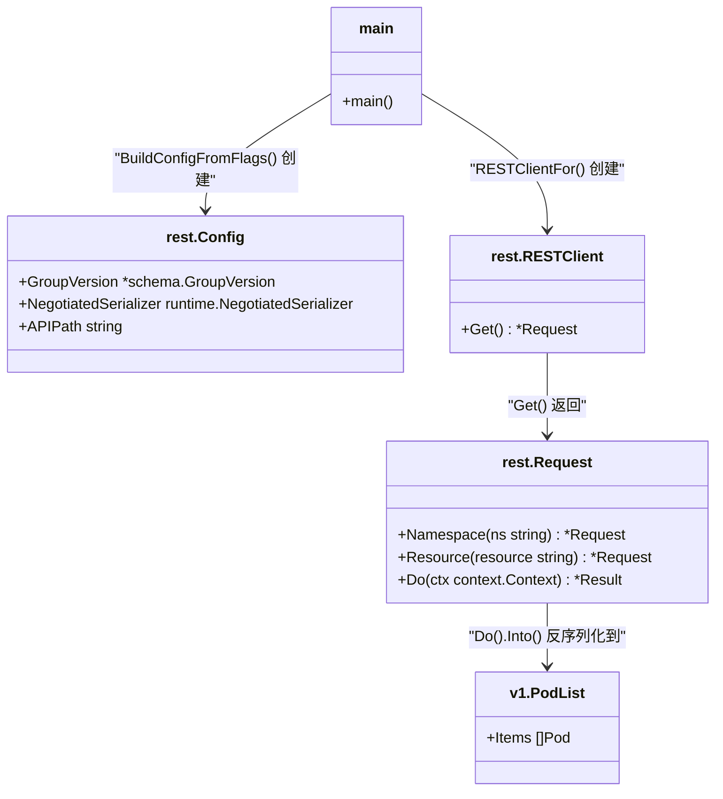
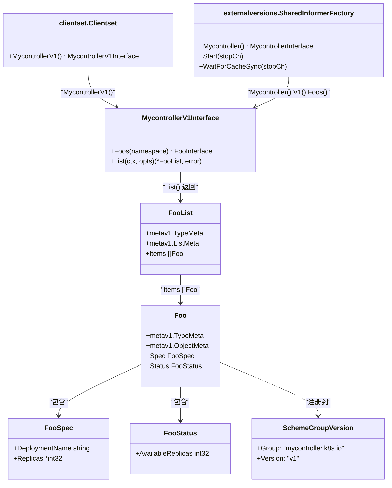
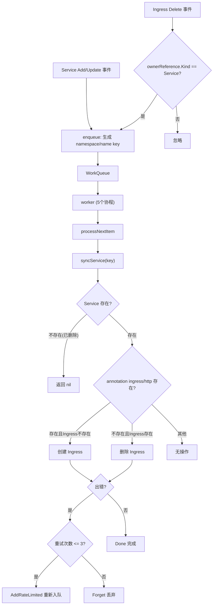
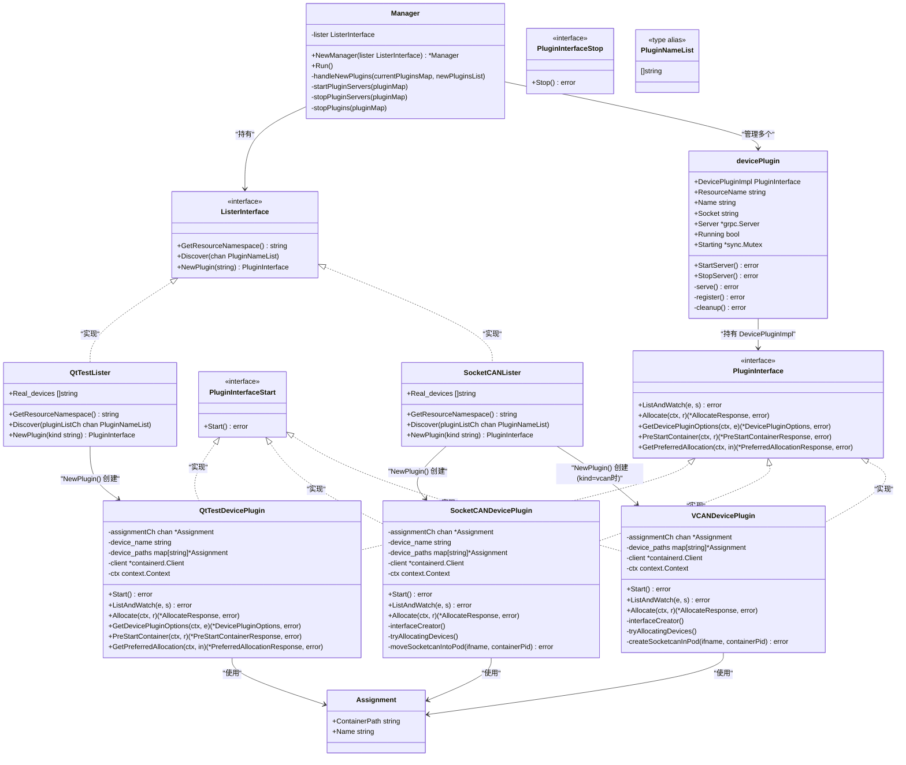
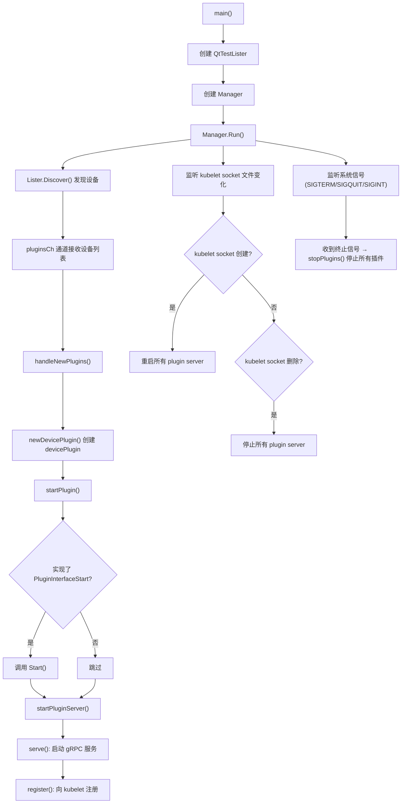
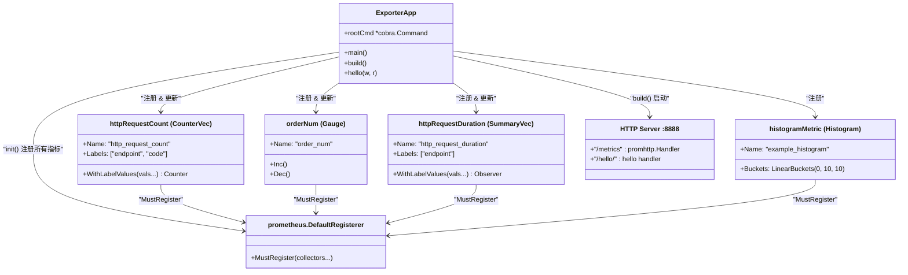
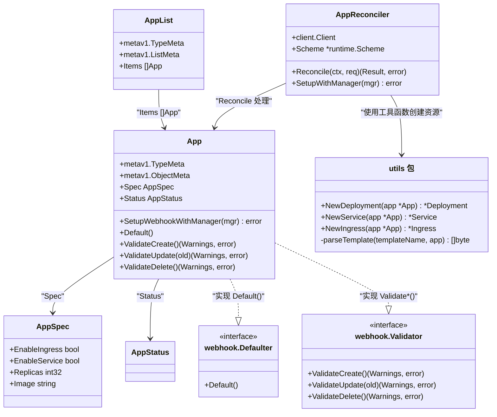
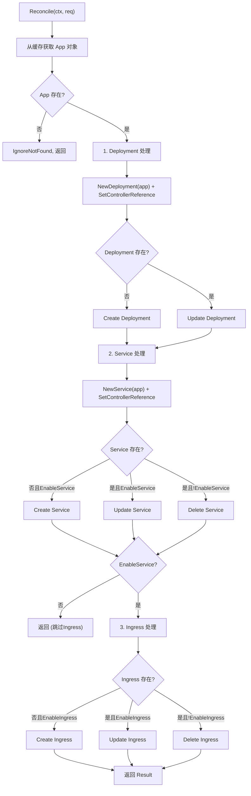

# Go Kubernetes 开发示例集

本项目是一组使用 Go 语言进行 Kubernetes 开发的示例代码，涵盖了从基础客户端使用到高级控制器开发、设备插件、Prometheus Exporter 以及 Webhook 等多种场景。

## 项目结构

```
├── doc/                           # 文档资料
│   ├── code-generator.md          # code-generator 使用说明
│   └── RuntimeService.proto       # CRI RuntimeService 协议定义
├── fsnotify.md                    # fsnotify 文件监听库使用说明
├── pkg/
│   ├── rest_client/               # 模块1: RESTClient 示例
│   │   └── main.go
│   ├── clientset/                 # 模块2: ClientSet + Informer 示例
│   │   └── clientset_demo.go
│   ├── crd/                       # 模块3: 自定义 CRD 示例
│   │   ├── api/mycontroller/v1/   # CRD 类型定义
│   │   ├── client/                # code-generator 生成的客户端
│   │   ├── hack/                  # 代码生成脚本
│   │   ├── manifest/              # CRD YAML 定义
│   │   └── main.go
│   ├── my-controller-demo/        # 模块4: 自定义控制器
│   │   ├── pkg/my_controller.go   # 控制器核心实现
│   │   └── main.go
│   ├── device_plugin/             # 模块5: K8s 设备插件
│   │   ├── common/constant.go     # 公共常量
│   │   ├── manage/                # 插件管理框架
│   │   │   ├── manager.go         # Manager 管理器
│   │   │   ├── lister.go          # ListerInterface 接口
│   │   │   └── plugin.go          # PluginInterface & devicePlugin
│   │   ├── plugin/                # 具体插件实现
│   │   │   ├── my_plugin.go       # QtTest 设备插件
│   │   │   ├── my_plugin_lister.go# QtTest 设备列表器
│   │   │   ├── my_plugin_service.go# QtTest gRPC 服务实现
│   │   │   ├── socket.go          # SocketCAN 设备插件
│   │   │   └── wcan.go            # VCAN 虚拟设备插件
│   │   └── main.go
│   ├── exporter/                  # 模块6: Prometheus Exporter
│   │   ├── main.go
│   │   └── my-prometheus-server.yaml
│   ├── kubebuilder/               # 模块7: Kubebuilder 示例
│   │   ├── crd/
│   │   │   ├── api/v1/            # App CRD 类型 & Webhook
│   │   │   └── internal/controller/ # 控制器 & 工具函数
│   │   ├── kubebuilder.md
│   │   └── webhook.md
│   └── webhook/                   # 模块8: Webhook e2e 示例
│       └── e2e_example/           # 多种 Webhook handler
```

---

## 模块1: RESTClient 示例 (`pkg/rest_client/`)

使用 Kubernetes 最底层的 `rest.RESTClient` 直接与 API Server 交互，获取 Pod 列表。

### 核心流程

1. 通过 `clientcmd.BuildConfigFromFlags` 加载 kubeconfig 配置文件
2. 设置 `GroupVersion` 为 `v1.SchemeGroupVersion`
3. 设置 `NegotiatedSerializer` 为 `scheme.Codecs`
4. 设置 `APIPath` 为 `/api`
5. 使用 `rest.RESTClientFor(config)` 创建 REST 客户端
6. 调用 `restClient.Get().Namespace("default").Resource("pods").Do(ctx).Into(&pods)` 获取 Pod 列表

### 类图



### 运行方式

```bash
cd pkg/rest_client
go run main.go
```

---

## 模块2: ClientSet + Informer 示例 (`pkg/clientset/`)

展示如何使用 `kubernetes.Clientset` 结合 `SharedInformerFactory` 监听 Kubernetes Pod 资源事件。

### 核心流程

1. 通过 `clientcmd.BuildConfigFromFlags` 加载 kubeconfig
2. 使用 `kubernetes.NewForConfig(config)` 创建 ClientSet
3. 通过 `informers.NewSharedInformerFactoryWithOptions` 创建 Informer 工厂（限定 `default` 命名空间）
4. 获取 Pod Informer: `factory.Core().V1().Pods().Informer()`
5. 注册 `AddFunc`、`UpdateFunc`、`DeleteFunc` 事件处理函数
6. 启动 Informer 并等待缓存同步

### 类图

```
classDiagram
    class main {
        +main()
    }
    class Clientset["kubernetes.Clientset"] {
        +AppsV1() AppsV1Interface
        +CoreV1() CoreV1Interface
    }
    class SharedInformerFactory["informers.SharedInformerFactory"] {
        +Core() CoreInterface
        +Start(stopCh chan struct{})
        +WaitForCacheSync(stopCh chan struct{})
    }
    class PodInformer["cache.SharedIndexInformer"] {
        +AddEventHandler(handler ResourceEventHandlerFuncs)
    }
    class ResourceEventHandlerFuncs["cache.ResourceEventHandlerFuncs"] {
        +AddFunc func(obj interface{})
        +UpdateFunc func(oldObj, newObj interface{})
        +DeleteFunc func(obj interface{})
    }

    main --> Clientset : "NewForConfig() 创建"
    main --> SharedInformerFactory : "NewSharedInformerFactoryWithOptions() 创建"
    SharedInformerFactory --> PodInformer : "Core().V1().Pods().Informer()"
    PodInformer --> ResourceEventHandlerFuncs : "AddEventHandler() 注册"
```

### 运行方式

```bash
cd pkg/clientset
go run clientset_demo.go
```

---

## 模块3: 自定义 CRD 示例 (`pkg/crd/`)

使用 `code-generator` 为自定义资源 `Foo` 自动生成 clientset、informer、lister 等客户端代码。

### CRD 定义

| 属性 | 值 |
|------|------|
| Group | `mycontroller.k8s.io` |
| Version | `v1` |
| Kind | `Foo` |
| Spec | `deploymentName` (string), `replicas` (*int32) |
| Status | `availableReplicas` (int32) |

### 类图



### 核心流程

1. 使用 `clientcmd.BuildConfigFromFlags` 加载配置
2. 使用生成的 `clientset.NewForConfig(config)` 创建自定义 ClientSet
3. 调用 `clientset.MycontrollerV1().Foos("default").List(ctx, opts)` 列出 Foo 资源
4. 创建 `externalversions.NewSharedInformerFactoryWithOptions` Informer 工厂
5. 注册 Foo 的 Add/Delete/Update 事件处理
6. 启动 Informer 并等待缓存同步

### 使用步骤

```bash
# 1. 安装 CRD
kubectl apply -f pkg/crd/manifest/my-crd.yaml

# 2. 运行程序
cd pkg/crd
go run main.go
```

详细的 code-generator 使用说明请参考 `doc/code-generator.md`。

---

## 模块4: 自定义控制器示例 (`pkg/my-controller-demo/`)

实现了一个基于 Informer + WorkQueue 的自定义控制器，自动管理 Service 与 Ingress 的关联。

### 业务需求

1. **创建 Service** 时，如果包含 annotation `ingress/http: true`，自动创建对应的 Ingress
2. **删除 Service** 时，通过 `ownerReferences` 自动级联删除关联的 Ingress
3. **更新 Service** 时，根据 annotation 的变化自动创建或删除 Ingress
4. **Ingress 被意外删除** 时，自动重新创建（仅当对应 Service 的 ownerReference 为 Service 类型时触发）

### 类图

```mermaid
classDiagram
    class MyController {
        -restClient kubernetes.Interface
        -serviceLister v1.ServiceLister
        -ingressLister netv1.IngressLister
        -queue workqueue.TypedRateLimitingInterface
        +NewMyController(clientSet, serviceInformer, ingressInformer) *MyController
        +Run(stopCh chan struct{})
        -worker()
        -processNextItem() bool
        -syncService(key string) error
        -handlerError(key string, err error)
        -constructIngress(service *Service) *Ingress
        -addService(obj interface{})
        -updateService(oldObj, newObj interface{})
        -deleteIngress(obj interface{})
        -enqueue(obj interface{})
    }
    class ServiceInformer["v13.ServiceInformer"] {
        +Informer() cache.SharedIndexInformer
        +Lister() v1.ServiceLister
    }
    class IngressInformer["v14.IngressInformer"] {
        +Informer() cache.SharedIndexInformer
        +Lister() netv1.IngressLister
    }
    class WorkQueue["workqueue.TypedRateLimitingInterface"] {
        +Add(item)
        +Get() (item, shutdown)
        +Done(item)
        +NumRequeues(item) int
        +AddRateLimited(item)
        +Forget(item)
    }
    class Constants["常量配置"] {
        +workNum = 5
        +maxRetry = 3
        +annotationsKey = "ingress/http"
        +templateFile = "deploy/IngressTemplate.yml"
    }

    MyController --> ServiceInformer : "监听 Service Add/Update"
    MyController --> IngressInformer : "监听 Ingress Delete"
    MyController --> WorkQueue : "使用工作队列"
    MyController ..> Constants : "使用配置"
```

### 控制器工作流程图



### 运行方式

```bash
cd pkg/my-controller-demo
go run main.go
```

---

## 模块5: Kubernetes 设备插件示例 (`pkg/device_plugin/`)

实现了一个完整的 Kubernetes Device Plugin 框架，包含管理层（manage/）和具体实现层（plugin/）。

### 类图



### 设备插件工作流程图



### 核心接口说明

| 接口方法 | 说明 |
|----------|------|
| `ListAndWatch` | 返回设备列表，当设备状态变化时推送更新。SocketCAN/VCAN/QtTest 各自实现，周期性发送设备状态 |
| `Allocate` | 容器创建时调用，返回 `DeviceSpec`（HostPath、ContainerPath、Permissions），并将分配请求发送到 assignmentCh |
| `GetDevicePluginOptions` | 返回插件选项（当前返回空选项） |
| `PreStartContainer` | 容器启动前的预处理（当前为空实现） |
| `GetPreferredAllocation` | 返回优选设备分配方案（当前为空实现） |

### 公共常量 (`common/constant.go`)

| 常量 | 值 | 说明 |
|------|------|------|
| `ResourceNamespace` | `k8s.collabora.com` | SocketCAN 资源命名空间 |
| `ContainerWaitDelaySeconds` | `5` | 容器检查等待间隔(秒) |
| `VcanNameTemplate` | `vcan%d` | VCAN 接口命名模板 |

QtTestLister 的 `ResourceNamespace` 为 `plugin-test`。

### 运行方式

```bash
cd pkg/device_plugin
export devices="device1,device2"
go run main.go
```

---

## 模块6: Prometheus Exporter 示例 (`pkg/exporter/`)

展示如何使用 `prometheus/client_golang` 库创建自定义 Prometheus 指标导出器。

### 类图



### Prometheus 指标详解

| 指标名称 | 类型 | 标签 | 说明 |
|----------|------|------|------|
| `http_request_count` | **Counter** | `endpoint`, `code` | HTTP 请求计数，只增不减。每次请求 `/hello/` 时 `Inc()` |
| `order_num` | **Gauge** | 无 | 订单数量仪表盘，可增可减。随机数>=90时 `Dec()`，否则 `Inc()` |
| `http_request_duration` | **Summary** | `endpoint` | HTTP 请求耗时分布(毫秒)。通过 `Observe()` 记录每次请求耗时 |
| `example_histogram` | **Histogram** | 无 | 直方图示例，桶边界: `LinearBuckets(0, 10, 10)` 即 [0,10,20,...,90] |

### 业务逻辑 (`hello` handler)

1. Counter `http_request_count` 对每个请求执行 `Inc()`，标签为 `(endpoint=请求路径, code="200")`
2. 生成随机数 n∈[0,100)：
   - n >= 90：`orderNum.Dec()` 并 sleep 100ms
   - n < 90：`orderNum.Inc()` 并 sleep 50ms
3. Summary `http_request_duration` 记录请求耗时（毫秒级）

### 运行方式

```bash
cd pkg/exporter
go run main.go
# 访问 http://localhost:8888/metrics 查看指标
# 访问 http://localhost:8888/hello/test 触发指标更新
```

配套 Prometheus 配置文件: `my-prometheus-server.yaml`，包含 K8s API Server、Node、Pod、Service 等自动发现和抓取规则。

---

## 模块7: Kubebuilder 示例 (`pkg/kubebuilder/`)

使用 Kubebuilder 框架创建 CRD 控制器和 Webhook，自动管理 App 资源对应的 Deployment、Service、Ingress。

### 类图



### Reconcile 核心逻辑

`AppReconciler.Reconcile` 方法按顺序处理三种子资源：

1. **Deployment 处理**：
   - 使用 `utils.NewDeployment(app)` 从模板生成 Deployment
   - 通过 `controllerutil.SetControllerReference` 设置 OwnerReference
   - 若 Deployment 不存在则创建，已存在则更新

2. **Service 处理**：
   - 使用 `utils.NewService(app)` 从模板生成 Service
   - 若 `EnableService=true` 且 Service 不存在则创建
   - 若 `EnableService=true` 且已存在则更新
   - 若 `EnableService=false` 且已存在则删除

3. **Ingress 处理**（仅当 `EnableService=true` 时执行）：
   - 使用 `utils.NewIngress(app)` 从模板生成 Ingress
   - 若 `EnableIngress=true` 且 Ingress 不存在则创建
   - 若 `EnableIngress=true` 且已存在则更新
   - 若 `EnableIngress=false` 且已存在则删除

### Reconcile 流程图



### Webhook 说明

App 类型实现了两种 Webhook 接口：

| Webhook 类型 | 路径 | 说明 |
|-------------|------|------|
| **Mutating** | `/mutate-k8s-qt-qt-domain-v1-app` | 调用 `Default()` 方法设置默认值 |
| **Validating** | `/validate-k8s-qt-qt-domain-v1-app` | 在 Create/Update 时调用 `ValidateCreate()`/`ValidateUpdate()` 校验 |

### SetupWithManager 配置

```go
ctrl.NewControllerManagedBy(mgr).
    For(&App{}).           // 监听 App 资源的变化
    Owns(&Deployment{}).   // 监听 App 拥有的 Deployment 变化
    Owns(&Ingress{}).      // 监听 App 拥有的 Ingress 变化
    Owns(&Service{}).      // 监听 App 拥有的 Service 变化
    Complete(r)
```

详细文档请参考 `pkg/kubebuilder/kubebuilder.md` 和 `pkg/kubebuilder/webhook.md`。

---

## 模块8: Webhook e2e 示例 (`pkg/webhook/e2e_example/`)

提供多种 Admission Webhook handler 的完整示例，支持 v1 和 v1beta1 两个 API 版本，用于测试 Kubernetes MutatingAdmissionWebhook 和 ValidatingAdmissionWebhook。

### 类图



```mermaid
classDiagram
    class WebhookServer {
        +certFile string
        +keyFile string
        +port int
        +sidecarImage string
        +CmdWebhook *cobra.Command
        +main(cmd, args)
    }
    class admitHandler {
        +v1beta1 admitv1beta1Func
        +v1 admitv1Func
    }
    class Config {
        +CertFile string
        +KeyFile string
    }
    class configTLS_func["configTLS()"] {
        +configTLS(config Config) *tls.Config
    }
    class addLabel_handler["addLabel"] {
        +addLabel(ar AdmissionReview) *AdmissionResponse
    }
    class admitPods_handler["admitPods"] {
        +admitPods(ar AdmissionReview) *AdmissionResponse
    }
    class mutatePods_handler["mutatePods"] {
        +mutatePods(ar AdmissionReview) *AdmissionResponse
    }
    class mutatePodsSidecar_handler["mutatePodsSidecar"] {
        +mutatePodsSidecar(ar AdmissionReview) *AdmissionResponse
    }
    class admitConfigMaps_handler["admitConfigMaps"] {
        +admitConfigMaps(ar AdmissionReview) *AdmissionResponse
    }
    class mutateConfigmaps_handler["mutateConfigmaps"] {
        +mutateConfigmaps(ar AdmissionReview) *AdmissionResponse
    }
    class alwaysDeny_handler["alwaysDeny"] {
        +alwaysDeny(ar AdmissionReview) *AdmissionResponse
    }
    class alwaysAllow_handler["alwaysAllowDelayFiveSeconds"] {
        +alwaysAllowDelayFiveSeconds(ar AdmissionReview) *AdmissionResponse
    }
    class denySpecificAttachment_handler["denySpecificAttachment"] {
        +denySpecificAttachment(ar AdmissionReview) *AdmissionResponse
    }

    WebhookServer --> Config : "创建 TLS 配置"
    WebhookServer --> admitHandler : "注册多个 handler"
    Config --> configTLS_func : "加载证书"
    admitHandler --> addLabel_handler : "/add-label"
    admitHandler --> admitPods_handler : "/pods"
    admitHandler --> mutatePods_handler : "/mutating-pods"
    admitHandler --> mutatePodsSidecar_handler : "/mutating-pods-sidecar"
    admitHandler --> admitConfigMaps_handler : "/configmaps"
    admitHandler --> mutateConfigmaps_handler : "/mutating-configmaps"
    admitHandler --> alwaysDeny_handler : "/always-deny"
    admitHandler --> alwaysAllow_handler : "/always-allow-delay-5s"
    admitHandler --> denySpecificAttachment_handler : "/pods/attach"
```

### Webhook Handler 列表

| 路径 | 类型 | 说明 |
|------|------|------|
| `/add-label` | Mutating | 为资源添加 `{"added-label": "yes"}` 标签，根据现有标签状态选择 add/replace 操作 |
| `/always-deny` | Validating | 始终拒绝请求 |
| `/always-allow-delay-5s` | Validating | 延迟5秒后始终允许请求 |
| `/pods` | Validating | 验证 Pod：拒绝含有 `webhook-disallow` 标签或容器名的 Pod |
| `/pods/attach` | Validating | 拒绝对 `to-be-attached-pod` 的 `container1` 执行 attach 操作 |
| `/mutating-pods` | Mutating | 为指定 Pod 注入 init container (`webhook-added-init-container`) |
| `/mutating-pods-sidecar` | Mutating | 为 Pod 注入 sidecar 容器 |
| `/configmaps` | Validating | 拒绝包含 `webhook-e2e-test=webhook-disallow` 的 ConfigMap 创建/更新；拒绝删除包含 `webhook-e2e-test=webhook-nondeletable` 的 ConfigMap |
| `/mutating-configmaps` | Mutating | 为 ConfigMap 添加 `mutation-stage-1` 或 `mutation-stage-2` 数据字段（多阶段变更管道） |
| `/custom-resource` | Validating | 自定义资源验证 |
| `/mutating-custom-resource` | Mutating | 自定义资源变更 |
| `/crd` | Validating | CRD 定义验证 |
| `/readyz` | Health | 健康检查端点，返回 "ok" |

### 核心架构

1. **版本兼容**：通过 `admitHandler` 结构体同时支持 `v1` 和 `v1beta1` AdmissionReview，内部使用 `delegateV1beta1AdmitToV1` 将 v1beta1 请求转换为 v1 处理
2. **统一处理函数 `serve()`**：负责 HTTP 请求解析、反序列化 AdmissionReview、路由到对应版本的处理函数、序列化响应
3. **TLS 配置**：通过 `configTLS()` 加载证书文件，所有 Webhook 通过 HTTPS 提供服务
4. **JSON Patch**：Mutating Webhook 使用 JSON Patch (`v1.PatchTypeJSONPatch`) 格式修改资源

### 运行方式

```bash
cd pkg/webhook/e2e_example
go run . --tls-cert-file=<cert-path> --tls-private-key-file=<key-path> --port=443
```

---

## 构建与部署

### 通用构建命令

```bash
CGO_ENABLED=0 GOOS=linux GOARCH=amd64 go build main.go
```

### 注意事项

- 大部分示例中 kubeconfig 路径为硬编码，使用前请根据实际环境修改
- 运行设备插件示例需要在 Kubernetes 节点上执行
- Webhook 示例需要有效的 TLS 证书
- Kubebuilder 示例需要先安装 kubebuilder 工具链
