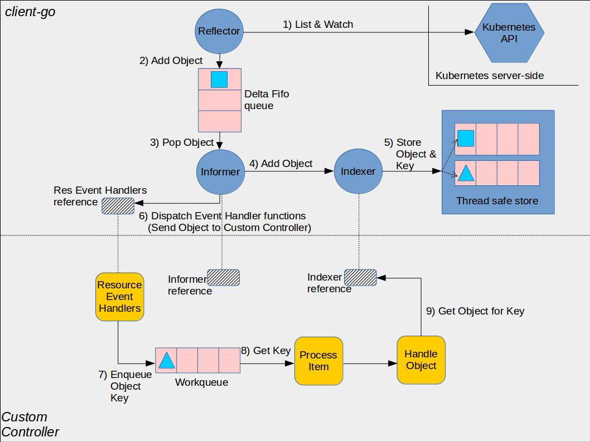

# Customer Controller
自定义控制器能够完成业务逻辑，最主要是依赖 client-go 库的各个组件的交互。下图展示它们之间的关系：  

通过图示，可以看到几个核心组件的交互流程，蓝色表示 client-go，黄色是自定义 controller，各组件作用介绍如下：

### client-go 组件
* Reflector：reflector 用来 watch 特定的 k8s API 资源。具体的实现是通过 ListAndWatch 的方法，watch 可以是 k8s 内建的资源或者是自定义的资源。当 reflector 通过 watch API 接收到有关新资源实例存在的通知时，它使用相应的列表 API 获取新创建的对象，并将其放入 watchHandler 函数内的 Delta FIFO 队列中。
* Informer：informer 从 Delta FIFO 队列中弹出对象。执行此操作的功能是 processLoop。base controller 的作用是保存对象以供以后检索，并调用我们的控制器将对象传递给它。
* Indexer：索引器提供对象的索引功能。典型的索引用例是基于对象标签创建索引。 Indexer 可以根据多个索引函数维护索引。Indexer 使用线程安全的数据存储来存储对象及其键。 在 Store 中定义了一个名为 MetaNamespaceKeyFunc 的默认函数，该函数生成对象的键作为该对象的 namespace/name 组合。

## 自定义 controller 组件
* Informer reference：指的是 Informer 实例的引用，定义如何使用自定义资源对象。自定义控制器代码需要创建对应的 Informer。
* Indexer reference：自定义控制器对 Indexer 实例的引用。自定义控制器需要创建对应的 Indexer。
* Resource Event Handlers：资源事件回调函数，当它想要将对象传递给控制器时，它将被调用。编写这些函数的典型模式是获取调度对象的 key，并将该 key 排入工作队列以进行进一步处理。
* Work queue：任务队列。编写资源事件处理程序函数以提取传递的对象的 key 并将其添加到任务队列。
* Process Item：处理任务队列中对象的函数，这些函数通常使用 Indexer 引用或 Listing 包装器来重试与该 key 对应的对象。

简单的说，整个处理流程大概为：Reflector 通过检测 Kubernetes API 来跟踪该扩展资源类型的变化，一旦发现有变化，就将该 Object 存储队列中，Informer 循环取出该 Object 并将其存入 Indexer 进行检索，同时触发 Callback 回调函数，并将变更的 Object Key 信息放入到工作队列中，此时自定义 Controller 里面的 Process Item 就会获取工作队列里面的 Key，并从 Indexer 中获取 Key 对应的 Object，从而进行相关的业务处理。

